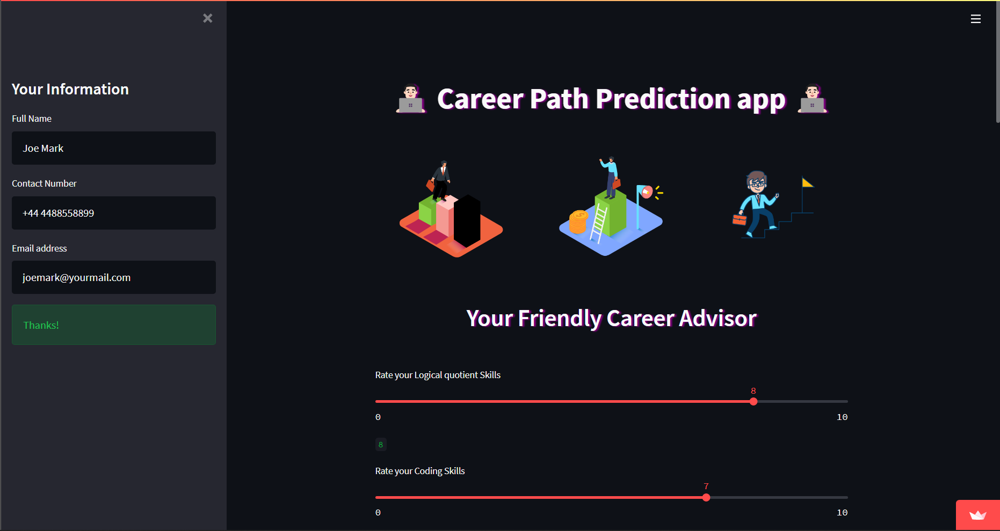
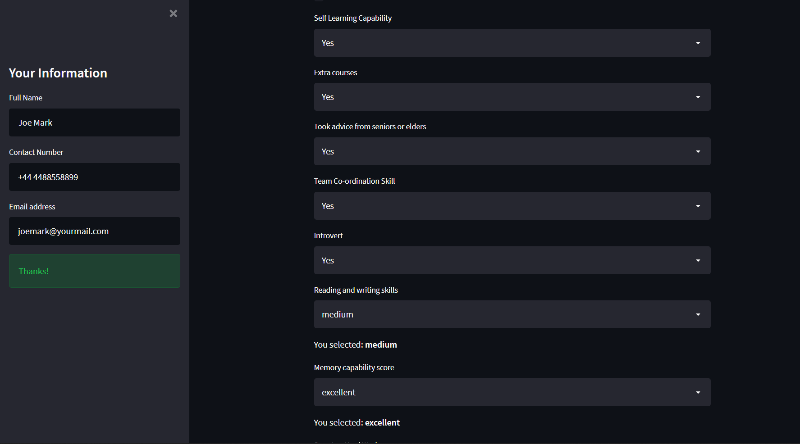
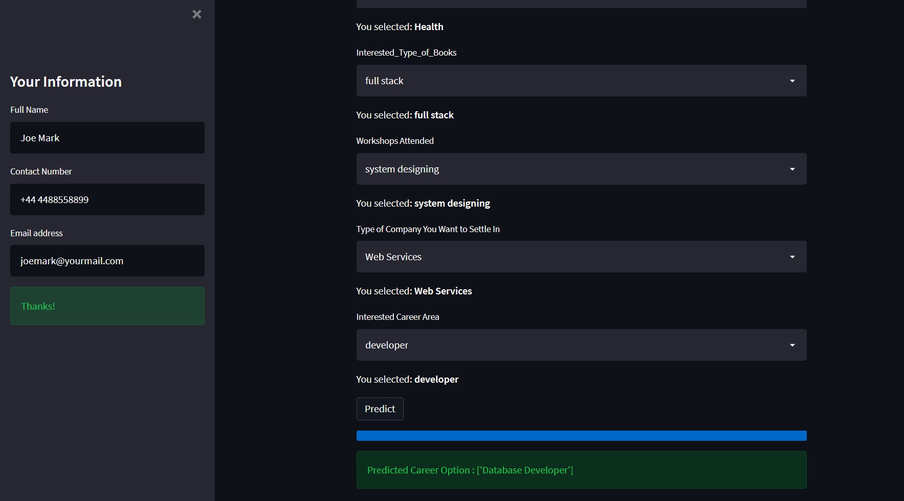

# Career-Prediction-System

This is a Career based Recommendation System project. Choosing the right career path is often a difficult decision for a student as a student goes through multiple phases like peer pressure, parents’ pressure, etc. during this time. So, to help students in such conditions developed a model that guides the student based on his/her profile and skill ratings. This model extracts unique features from the profile and predicts the best-fit career option and also predicts what career options one should not go for. This will help the student to excel in the field in which he/she is really capable in.

### __Checkout the [webApp](https://share.streamlit.io/hrugved06/career-prediction-system/main/app.py) deployed on the streamlit platform.__

- ## Preview

 

 

##  Developed by :

<a href="https://github.com/hrugved06"> <b> Hrugved Kolhe</b></a>
 

 

 

 

 
